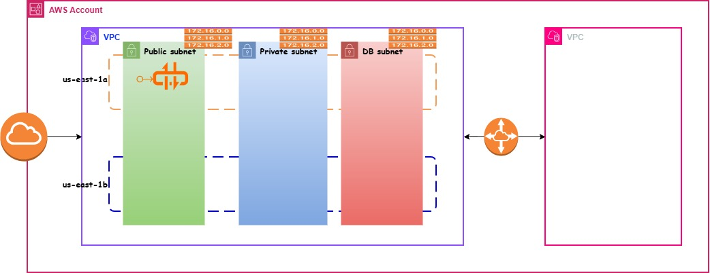

# 🌐 terraform-aws-vpc

A **production-ready Terraform module** for provisioning an AWS VPC with:

- Public, Private, and Database subnet tiers  
- Internet Gateway  
- NAT Gateway with Elastic IP  
- Dedicated Route Tables per tier  
- Optional VPC Peering support  
- Fully customizable tagging  

This module is designed following real-world DevOps infrastructure standards.

---

# 🚀 Usage

```hcl
module "vpc" {
  source = "git::https://github.com/daws-88s/terraform-aws-vpc.git?ref=main"

  project     = "roboshop"
  environment = "dev"

  vpc_cidr = "10.0.0.0/16"

  public_subnet_cidrs   = ["10.0.1.0/24", "10.0.2.0/24"]
  private_subnet_cidrs  = ["10.0.11.0/24", "10.0.12.0/24"]
  database_subnet_cidrs = ["10.0.21.0/24", "10.0.22.0/24"]

  is_peering_required = false
}
```

---

# ✨ Features

- ✅ VPC with configurable CIDR block
- ✅ DNS hostnames and DNS support enabled
- ✅ Public, Private, and Database subnets across multiple AZs
- ✅ Internet Gateway for public subnet internet access
- ✅ NAT Gateway (with Elastic IP) for outbound access from private and database subnets
- ✅ Separate Route Tables per subnet tier
- ✅ Optional VPC Peering support
- ✅ Custom tagging support on all resources
- ✅ Production-grade naming convention

---

# 📦 Resources Created

| Name | Type |
|------|------|
| aws_vpc.main | resource |
| aws_internet_gateway.main | resource |
| aws_subnet.public | resource |
| aws_subnet.private | resource |
| aws_subnet.database | resource |
| aws_eip.nat | resource |
| aws_nat_gateway.main | resource |
| aws_route_table.public | resource |
| aws_route_table.private | resource |
| aws_route_table.database | resource |
| aws_route.public | resource |
| aws_route.private | resource |
| aws_route.database | resource |
| aws_route_table_association.public | resource |
| aws_route_table_association.private | resource |
| aws_route_table_association.database | resource |

---

# 📥 Inputs

| Name | Description | Type | Default | Required |
|------|-------------|------|----------|----------|
| **project** | Project name used for naming and tagging resources | string | n/a | yes |
| **environment** | Deployment environment (dev, qa, uat, prod) | string | n/a | yes |
| **vpc_cidr** | CIDR block for the VPC | string | `"10.0.0.0/16"` | no |
| **public_subnet_cidrs** | List of CIDR blocks for public subnets | list(string) | `["10.0.1.0/24", "10.0.2.0/24"]` | no |
| **private_subnet_cidrs** | List of CIDR blocks for private subnets | list(string) | `["10.0.11.0/24", "10.0.12.0/24"]` | no |
| **database_subnet_cidrs** | List of CIDR blocks for database subnets | list(string) | `["10.0.21.0/24", "10.0.22.0/24"]` | no |
| **vpc_tags** | Additional tags for VPC | map(string) | `{}` | no |
| **igw_tags** | Additional tags for Internet Gateway | map(string) | `{}` | no |
| **public_subnet_tags** | Additional tags for public subnets | map(string) | `{}` | no |
| **private_subnet_tags** | Additional tags for private subnets | map(string) | `{}` | no |
| **database_subnet_tags** | Additional tags for database subnets | map(string) | `{}` | no |
| **public_route_table_tags** | Additional tags for public route table | map(string) | `{}` | no |
| **private_route_table_tags** | Additional tags for private route table | map(string) | `{}` | no |
| **database_route_table_tags** | Additional tags for database route table | map(string) | `{}` | no |
| **eip_tags** | Additional tags for Elastic IP | map(string) | `{}` | no |
| **nat_gateway_tags** | Additional tags for NAT Gateway | map(string) | `{}` | no |
| **is_peering_required** | Enables VPC peering resources when true | bool | `false` | no |

---

# 📤 Outputs

| Name | Description |
|------|-------------|
| **vpc_id** | ID of the created VPC |
| **public_subnet_ids** | List of public subnet IDs |
| **private_subnet_ids** | List of private subnet IDs |
| **database_subnet_ids** | List of database subnet IDs |

> Outputs should be defined in `outputs.tf`.

---

# 🏷 Subnet Naming Convention

Resources follow this standardized naming pattern:

```
{project}-{environment}-{tier}-{availability-zone}
```

### Example:

```
roboshop-dev-public-us-east-1a
roboshop-dev-private-us-east-1b
roboshop-dev-database-us-east-1a
```

This ensures consistent and production-friendly resource naming.

---
# 🛠 Requirements

- Terraform >= 1.5
- AWS Provider >= 5.0
- AWS account with VPC permissions
--
# **Architecture**
<p align="center">
  
</p>